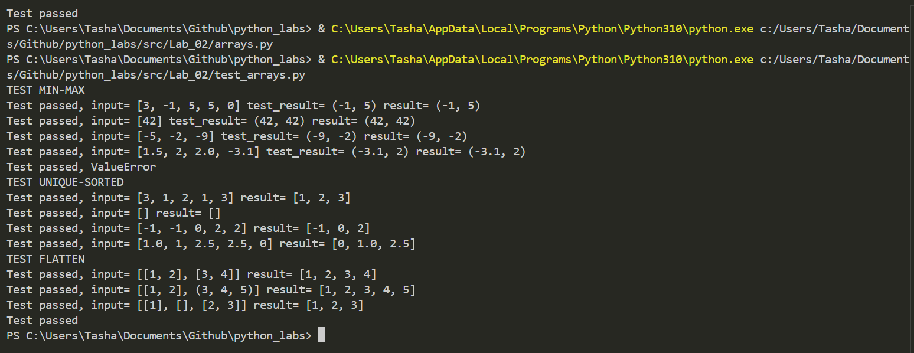

# Лабораторная работа 1
## №1
```python
print("НОМЕР 1: ПРИВЕТ И ВОЗРАСТ")
name = input()
age = int(input())
print("Имя:", name)
print("Возраст:", age)
print("Привет,", name,"! Через год тебе будет", age+1,".")

```


## №2
```python
print("НОМЕР 2: СУММА И СРЕДНЕЕ")
a = input()
b = input()
if a.count(",")==1:
    a = a.replace(",",".")
if b.count(",")==1:
    b = b.replace(",",".")
a1 = float(a)
b1 = float(b)
summ = a1+b1
avg = summ/2
print("sum =",f"{summ:.2f}",";avg =",f"{avg:.2f}")

```


## №3
```python
print("НОМЕР 3: ЧЕК: СКИДКА И НДС")
price = float(input())
discount = float(input())
vat = float(input())
base = price * (1 - discount/100)
vat_amount = base * (vat/100)
total = base + vat_amount
print("База после скидки:", f"{base:.2f}","₽")
print("НДС:",f"{vat_amount:.2f}","₽")
print("Итого к оплате:",f"{total:.2f}","₽")

```


## №4
```python
print("НОМЕР 4: МИНУТЫ - ЧЧ:ММ")
min = int(input())
hours = min//60
minutes = min%60
print(f"{hours:02d}:{minutes:02d}")

```


## №5
```python
print("НОМЕР 5: ИНИЦИАЛЫ И ДЛИНА СТРОКИ")
full_name = input()
words = full_name.strip().split()
cleanwords = " ".join(words)
initials = ''.join(word[0].upper() for word in words) + '.'
print("ФИО:", full_name)
print("Инициалы:",initials)
print("Длина (символов):", len(cleanwords))

```


## №6
```python
print("НОМЕР 6: СО ЗВЁЗДОЧКОЙ")
n = int(input())
ochn = 0
zaochn = 0
for i in range(n):
    info = input()
    if info.count("True")==1:
        ochn+=1
    if info.count("False")==1:
        zaochn+=1
print("out:",ochn,zaochn)

```


## №7
```python
print("НОМЕР 7: ЗАДАНИЕ СО ЗВЁЗДОЧКОЙ")
start = input()
end = ""

first_index = None
for i in range(len(start)):
    if start[i].isupper():
        first_index = i
        break

first_2_index = None
for i in range(first_index + 1, len(start)):
    if start[i].isdigit():
        first_2_index = i
        break

step = (first_2_index + 1) - first_index


for i in range(first_index, len(start), step):
    end += start[i]
    if start[i] == '.':  
        break

print("in:",start)
print("out:",end)

```


# Лабораторная работа 2
## ЗАДАНИЕ A - ARRAYS.PY

```python
def min_max(nums: list[float | int]) -> tuple[float | int, float | int]:
    """
    min_max: Вернуть кортеж (минимум, максимум). Если список пуст — ValueError
    """
    if len(nums) == 0:
        raise ValueError

    mini = min(nums)
    maxi = max(nums)

    return (mini, maxi)

def unique_sorted(nums: list[float | int]) -> list[float | int]:
    """
    Вернуть отсортированный список уникальных значений (по возрастанию).
    """
    unique = set(nums)
    unique_result = sorted(unique)
    
    return unique_result

def flatten(nums: list[list | tuple]) -> list:
    """
    «Расплющить» список списков/кортежей в один список по строкам (row-major).
    Если встретилась строка/элемент, который не является списком/кортежем — TypeError.
    """
    result = []
    for i in nums:
        if type(i)==str:
            raise TypeError
        result += i 

    return result
```

```python
from arrays import min_max, unique_sorted, flatten


def test_min_max():

    tests = [
        [
            [3, -1, 5, 5, 0],
            (-1, 5),
        ],
        [
            [42],
            (42, 42),
        ],
        [
            [-5, -2, -9],
            (-9, -2)
        ],
        [
            [1.5, 2, 2.0, -3.1],
            (-3.1, 2),
        ],
    ]

    for t in tests:
        test_input = t[0]
        test_result = t[1]

        result = min_max(test_input)
        if result != test_result:
            print("Test failed, input=", test_input, "test_result=", test_result, "result=", result)
        else:
            print("Test passed, input=", test_input, "test_result=", test_result, "result=", result)


def test_min_max_error():
    try:  # ловушка для исключения (рейза)
        min_max([])
    except ValueError:
        print("Test passed, ValueError")


def test_unique_sorted():
    tests = [
        [
            [3, 1, 2, 1, 3], 
            [1, 2, 3],
        ],
        [
            [],
            [],
        ],
        [
            [-1, -1, 0, 2, 2],
            [-1, 0, 2],
        ],
        [
            [1.0, 1, 2.5, 2.5, 0],
            [0, 1.0, 2.5]
        ],

    ]

    for t in tests:
        start_unique = t[0]
        result_unique = t[1]
        result = unique_sorted(start_unique)

        if result == result_unique:
            print("Test passed, input=", start_unique, "result=", result_unique)
        else:
            print("Test failed, input=", start_unique, "result=", result, "result_unique=", result_unique)

 
def test_flatten():
     
    tests = [
        [
            [[1, 2], [3, 4]],
            [1, 2, 3, 4],
        ],
        [
            [[1, 2], (3, 4, 5)],
            [1, 2, 3, 4, 5],
        ],
        [
            [[1], [], [2, 3]],
            [1, 2, 3],
        ],
        
    ]

    for t in tests:
        input_flatten = t[0]
        result_flatten = t[1]

        result = flatten(input_flatten)
        if result == result_flatten:
            print("Test passed, input=", input_flatten,"result=", result_flatten)
        else:
            print("Test failed, input=", input_flatten, "result=", result, "result_flatten=", result_flatten)


def test_flatten_error():
    try: 
        flatten([[1, 2], "ab"])
    except TypeError:
        print("Test passed")
    else:
        print("Test failed")


print("TEST MIN-MAX")
test_min_max()
test_min_max_error()

print("TEST UNIQUE-SORTED")
test_unique_sorted()

print("TEST FLATTEN")
test_flatten()
test_flatten_error()


```

